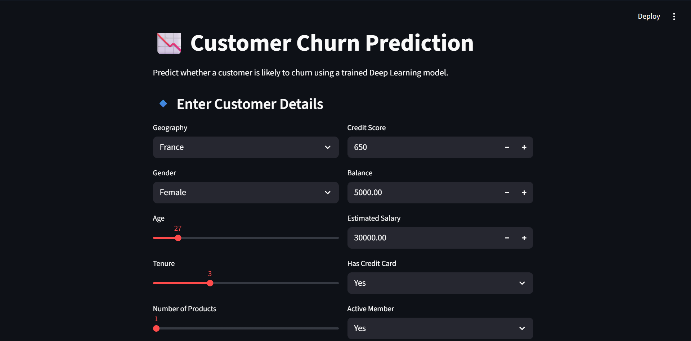

# 📉 Customer Churn Prediction using Deep Learning (ANN)

This project is a **Customer Churn Prediction web application** that uses a **Deep Learning Artificial Neural Network (ANN)** to predict whether a customer is likely to churn based on their demographic and financial details.  
The application is built with **TensorFlow**, **Streamlit**, and deployed on **Streamlit Cloud** for easy access.

---

## 📸 Preview

  


---

## 💡 Features

### 👤 User Input Interface
- Interactive form to input customer details such as:
  - Geography
  - Gender
  - Age & Tenure
  - Credit Score
  - Balance & Salary
  - Number of Products
  - Credit Card & Active Membership status
- Clean and responsive UI built using **Streamlit components**.

### 🧠 Deep Learning Model
- Uses a trained **Artificial Neural Network (ANN)** built with **TensorFlow / Keras**.
- Predicts the **probability of customer churn**.
- Model trained on historical customer data.

### 📊 Prediction Output
- Displays churn probability in percentage.
- Clear result indicators:
  - ✅ Not likely to churn
  - ⚠️ Likely to churn
- Modal popup for better UX.

### ⚡ Efficient & Scalable
- Uses **cached model loading** for faster performance.
- Deployed on **Streamlit Cloud** for easy scalability.

---

## 🧠 How It Works

1. User enters customer details via the form.
2. Input data is:
   - Encoded (Label Encoding & One-Hot Encoding)
   - Scaled using a trained Standard Scaler
3. The processed data is passed to the **ANN model**.
4. The model outputs a **churn probability**.
5. The result is displayed instantly in the UI.

---

## 🛠️ Tech Stack

| Technology | Purpose |
|----------|--------|
| **Python** | Core programming language |
| **TensorFlow / Keras** | Deep Learning (ANN model) |
| **Streamlit** | Web application framework |
| **Pandas / NumPy** | Data processing |
| **Scikit-learn** | Encoding & scaling |
| **Pickle** | Model & encoder serialization |
| **Streamlit Cloud** | Deployment |

---

## ⚙️ Installation & Local Setup

Follow these steps to run the project locally:

```bash
# Clone the repository
git clone https://github.com/priyan17singh/customer-churn-prediction.git

# Navigate to project directory
cd customer-churn-prediction

# Create virtual environment
python -m venv venv
source venv/bin/activate      # Linux/Mac
venv\Scripts\activate         # Windows

# Install dependencies
pip install -r requirements.txt

# Run the notebooks
experiment.ipynb
prediction.ipynb

# Run the Streamlit app
streamlit run app.py
```
---

## 👨‍💻 Author

**Priyanshu Singh**  
GitHub:  [@priyan17singh](https://github.com/priyan17singh)

---

## ❤️ Support

**If you like this project, don’t forget to give it a ⭐ on GitHub and share a cup of chai ☕ with the creator!**

*“Predicting churn today helps retain customers tomorrow.”*

---


